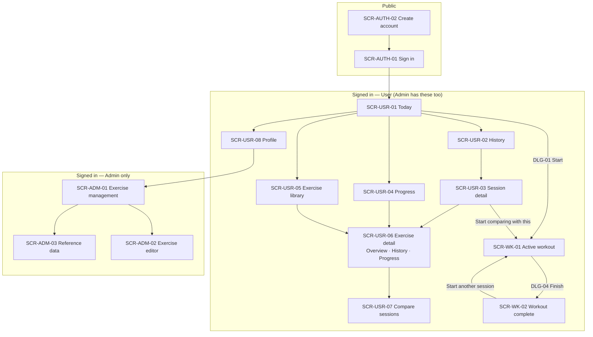
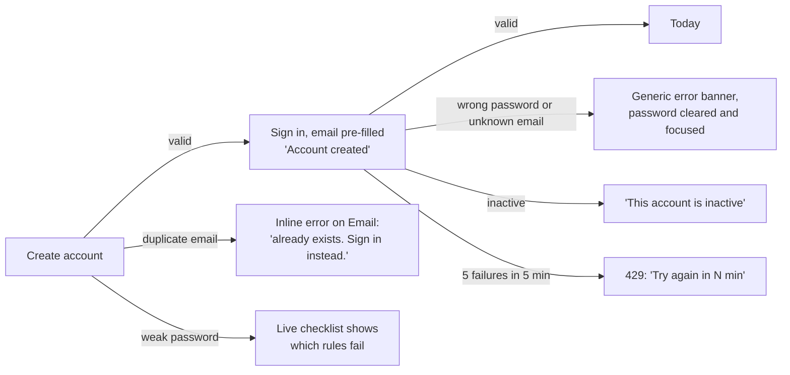
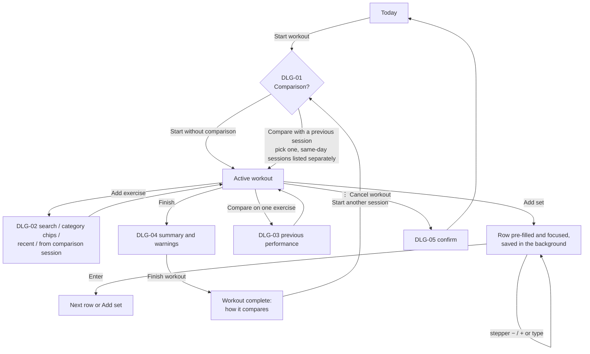
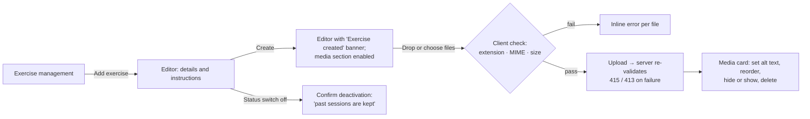

# 2. Information architecture and user flows

## 2.1 Sitemap

## 2.2 Navigation model

| Breakpoint | User area | Admin area | Active workout |
|---|---|---|---|
| < 1024 px (phones, tablets) | Top bar (brand and profile) and a **bottom tab bar**: Today · History · Progress · Exercises · Profile | Top bar with an *Admin* badge and a horizontal sub-navigation: Exercises · Reference data · Back to training | **Focus layout:** no tab bar or sidebar. A sticky header has a back button, status, timer and save state. A sticky bottom bar has *Add exercise* and *Finish*. |
| ≥ 1024 px (desktop) | **Left sidebar** with the same items. Admins also get an *Exercise admin* link. The user card links to Profile. | Sidebar on a darker surface with an *Admin* section label, to make the context switch obvious | Same focus layout, centred at 760 px |

Rules:

- The **active workout never shows global navigation** (§17). Leaving is explicit (← *Today*) and safe, because the workout stays *In progress* and Today shows a *Resume* card.
- The bottom tab bar is at most 5 items with icon *and* text labels.
- Every page has one `h1`. After navigation, focus moves to it so screen readers announce the new page.
- A **skip link** ("Skip to content") is the first focusable element.

## 2.3 Routes

The prototype uses hash routes. The ASP.NET Core web app would use the same paths without the `#`.

| Route | Screen | Access |
|---|---|---|
| `/login`, `/register` | SCR-AUTH-01, SCR-AUTH-02 | Guests only. Signed-in people are redirected to Today. |
| `/` | SCR-USR-01 Today | User |
| `/workout/{id}` | SCR-WK-01 Active workout | Owner. Completed or cancelled workouts redirect to `/history/{id}`. |
| `/workout/{id}/summary` | SCR-WK-02 Workout complete | Owner |
| `/history?exercise=&status=&range=` | SCR-USR-02 History | User |
| `/history/{id}` | SCR-USR-03 Session detail | Owner (404 otherwise) |
| `/progress` | SCR-USR-04 Progress | User |
| `/library?q=&category=` | SCR-USR-05 Exercise library | User |
| `/exercise/{id}?tab=overview\|history\|progress` | SCR-USR-06 Exercise detail | User |
| `/exercise/{id}/compare?a=&b=` | SCR-USR-07 Compare sessions | User |
| `/profile` | SCR-USR-08 Profile | User |
| `/admin/exercises?q=&status=&category=` | SCR-ADM-01 | Admin (403 page otherwise) |
| `/admin/exercises/new`, `/admin/exercises/{id}` | SCR-ADM-02 | Admin |
| `/admin/reference` | SCR-ADM-03 | Admin |

Filters and tabs are kept in the URL, so a view can be bookmarked or shared and the browser Back button restores it.

## 2.4 Workout session lifecycle

```mermaid
stateDiagram-v2
  [*] --> InProgress: Start workout (date and start time captured)
  InProgress --> InProgress: Add/remove exercise, add/edit/remove set (autosaved)
  InProgress --> Completed: Finish (≥1 set; empty exercises removed)
  InProgress --> Cancelled: Cancel workout (confirmed)
  Completed --> [*]: Read-only in History, used by Progress and Compare
  Cancelled --> [*]: Read-only in History, excluded from Progress and Compare
```

## 2.5 Core flows

### F1 — Register and sign in (§58)

### F2 — Log a workout (the priority flow)

Speed budget. The target for logging a set that repeats last time's count is **one tap** (*Add set*). For a different count it is **two taps** (a stepper tap), or a tap plus typing. No screen change is needed.

### F3 — Same-day second session and comparison (§30)

1. Finish the morning session. The summary offers **Start another session**.
2. Choose **Compare with a previous session** and pick *Today — Morning*. This morning appears as its own entry, separate from earlier dates.
3. The workout shows a **Comparing with** banner in the historical "paper log" style. Its exercises are offered as one-tap chips.
4. Each set row shows **Previous** (read-only, dashed and sand-coloured) and **Change** (arrow, sign and number).
5. History and exercise history show **"2 separate sessions"** under the date, each with its own label and time.

### F4 — Review progress

Today → *Recent exercises* or Progress → exercise → **Progress** tab. Choose a range (4 weeks, 12 weeks or all time). Stat tiles, the total-reps chart and the sessions-per-week chart all update, and a table view is available. From the **History** tab, *Compare* opens a set-by-set comparison of any two sessions.

### F5 — Admin: create an exercise with media (§58)

### F6 — Failure paths

| Situation | What the person sees |
|---|---|
| Offline during a workout | Offline banner at the top. Header shows *Offline · 3 changes waiting*. Rows not yet saved have an amber set number. Changes sync automatically when back online. |
| Refresh or closed tab during a workout | The session is still *In progress*. Today shows *Resume workout*. Queued changes are replayed from local storage. |
| Server error while saving | *Not saved · Retry* in the header. Automatic retry after 6 s. |
| Session expired | Toast, then the sign-in screen with "Your session has expired… Anything you logged is saved". After sign-in, the person returns to where they were. |
| Workout finished in another tab | The rejected change shows "This workout is completed and can no longer be changed". The screen reloads to the read-only session. |
| Opening another person's workout by ID | "We can't find that page" (404, D13). |
| User opens an admin URL | "You don't have access to this page" (403). |
